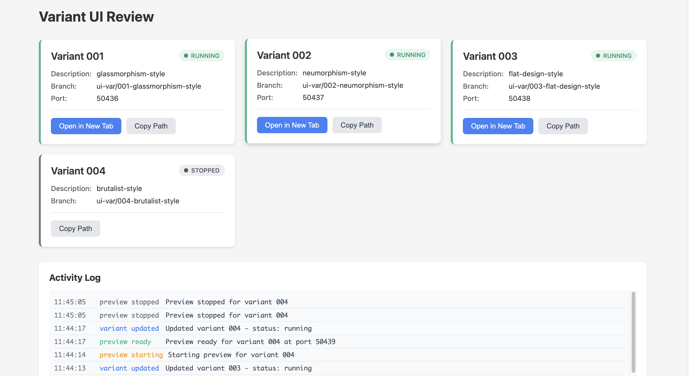

# variant-ui (Active Development)

MCP server for rapid UI iteration. Create, test, and compare multiple UI variants side-by-side.

## What it does

Spin up isolated git worktrees to test different UI approaches simultaneously. Each variant gets its own port, its own dependencies, and its own branch. Compare them in real-time, merge the winner.



## Prerequisites

- Node.js 18+
- Git
- npm (currently only npm is supported)
- MCP-compatible client (tested with Claude Code)

## Setup

1. Clone and build:
```bash
git clone git@github.com:btree1970/variant-ui.git
cd variant-ui
npm install
npm run build
```

2. Add to your MCP client:

### Claude Code
```bash
# Add with default port 5400
claude mcp add variant-ui node <path-to-variant-ui>/dist/index.js

# Or specify a custom port
claude mcp add variant-ui node <path-to-variant-ui>/dist/index.js --env VARIANT_UI_PORT=8080
```

**Important:** Add variant-ui to your project settings, not global settings. This tool is designed to run only when you're working on a specific project.

## Usage

**Pro tip:** For the best experience, enable auto-approval for file edits in the variant directories. This lets your AI agent work seamlessly without constant permission prompts.

Once added to your MCP client, you can use these commands in any conversation:

### Example prompts

Test different design approaches:
```
Create and preview 3 hero section variants: one with a video background, 
one with a static image, and come up with a third creative approach
```

Explore design systems:
```
Create 5 variants testing different visual styles for my dashboard: 
glassmorphism, neumorphism, flat design, material design, and brutalist. 
Try different color schemes and typography for each
```

Let AI suggest improvements:
```
I need to improve my checkout flow. Create and preview 3 different 
variants with your best ideas for reducing cart abandonment
```

Compare specific patterns:
```
Test sidebar navigation vs top navbar. Create both variants and 
show me how they look on mobile and desktop
```

Check what's running:
```
What variants do I have running?
```

Then open http://localhost:5400 (or your custom port) to see all your variants side-by-side in the review UI.

## Features

- **Isolated variants** - Each variant runs in its own git worktree
- **Auto port assignment** - No port conflicts between variants and projects
- **Live preview** - Start/stop dev servers for each variant
- **Review UI** - See all variants at a glance
- **Real-time updates** - SSE-powered activity log
- **Framework detection** - Works with Next.js (more coming)
- **Package manager** - Currently supports npm (yarn/pnpm coming soon)

## How it works

Variants are created as git worktrees in your temp directory. Each variant:
- Gets a unique branch (`ui-var/001-description`)
- Runs its own dev server (when previewing)
- Can be merged back to main when ready

## Feedback

This project is in active development. Found a bug? Have a feature request?
- Open an issue on GitHub
- Share what frameworks you'd like supported

## License

MIT
